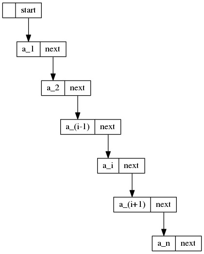

---
header-includes:
- \usepackage[american]{circuitikz}
- \usetikzlibrary{snakes,arrows,shapes}
- \usepackage{amsmath}
---
# Week 3 Notes

# Quiz 1 Review
## Problem 1

n | Power
-+-
1|$1=7^0$
2|$7=7^1$
3|$7^2$
.|.
.|.
n|$7^{n-1}$

* order n

## Problem 2
* order $n^2$

## Problem 3
* log(log(n)), log(n), (log(n))^2, etc.

# Back to notes
* <> is !=
* L: $a_1 , a_2 , a_3 , ... , a_{i-1} , a_{i} , a_{i+1} , ... , a_n$
* Desired List Operations:
	* FIRST(L)
	* END(L)
		* Returns end +1 position
	* RETRIEVE(p, L)
	* LOCATE(x, L)
	* NEXT(p, L)
	* PREVIOUS(p, L)
	* INSERT(x, p, L)
		* Variable p is assigned at point i, point i exists now at i+1
		* Rest are shifted over
	* DELETE(p, L)
		* Variable p is located at position i
		* now, $a_i = a_{i+1}$
		* Rest are shifted
	* MAKENULL(L)
		* Idk
* Same general stuff for stacks and queues

# Print List

```Pascal
procedure PRINTLIST(L:LIST);
{ PRINTLIST prints the elements of L in the order of occurrence }
	var
		p: position;
```

* Can get rest from notes, going over too quickly

# Going over array implementation
* For insertion, you need to shift everything down, this operates in a linear order/time
* For delete, you need to shift everything up. Deletion from the front
* constant, from the back, linear, I think, double check this one.

# List ADT Pointer Implementation



