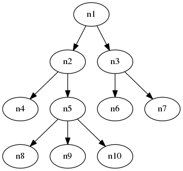
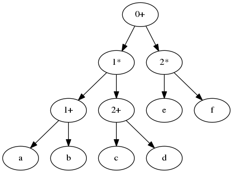
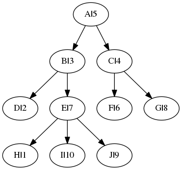
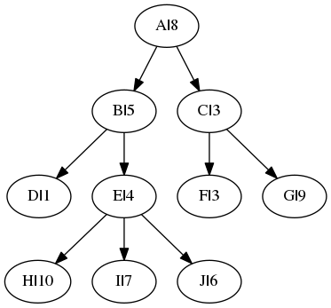

---
header-includes:
- \usepackage[american]{circuitikz}
- \usetikzlibrary{snakes,arrows,shapes}
- \usepackage{amsmath}
---
# Week 4 Notes - Tree Operations

## Upcoming Test
* 3 out of 5 problems need to be completed
* Review Friday
* Midterm Monday

## Trees:

* height is 3 from n1
* height is 2 from n2
* n2,n5,n9 a path of length 2
* n5 is a depth 2 from n1
* depth is height sometimes in the book
* preorder means do it during the first visit
* postorder means do it during the last visit
* preorder 1,2,4,5,8,9,10,3,6,7
* postorder 4,8,9,10,5,2,6,7,3,1

## Translate (a+b)*(c+d)+e*f

* preorder +*+ab+cd*ef
* postfix ab+cd+*ef*+

## Trees as a data structure
* look at slides, descriptions in book

* C(9), F(6), G(8)
* E(7), H(1), I(10), J(9)
* using linked-list representation to display a tree
* using same tree, next slide page

* E(4), H(10, I(7), J(6)
