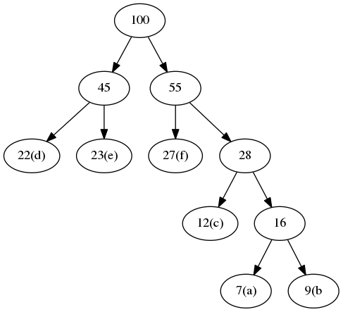

---
header-includes:
- \usepackage[american]{circuitikz}
- \usetikzlibrary{snakes,arrows,shapes}
- \usepackage{amsmath}
---

# Review of Set Notation
* Reviewing basic set information
* Know basic information like:
    * $A\cup B$, A union B
    * $A\cap B$, A intersect B
    * $x\in A$, A exists in A
    * $\emptyset$, Emptyset
    * $A \subseteq B$, A is a subset of B, A is also equal to B
* $A\{x \in \Z | \frac{2}{2}\} = the set of even integers
* $|$ means such that
* $A \backslash B$, what is in A but not in B, the difference

# Set Operations
* Know the ones from the slides/in the book
* procedure DIFFERENCE is on $O(n+m)$ complexity

# Hash Table
* Review notation from the notes, things like buckets, load factor, and hashing function
* Load factor is desired:

$$
\alpha = \frac{N}{B} >> 1
$$ 

* substantially larger than 1
* There are open and closed hash tables
* Open is arbitrarily sized?
* Closed wants:

$$
\alpha << 1
$$

* $hash_i (x) = (hash(x) + i) % B$
* Example we have frequency table:

-----------------
Letter	Frequency
------	---------
a		7
b		9
c		12
d		22
e		23
f		27
----------------

* This is called huffman encoding
* We can use a given tree based off this to easily encode symbols
* Procedure is:
    1. Start with list of sorted frequencies like above
    2. Then place that in the frequency list
* e.g. a and b become 16
* new order is created as that is placed after 16, but before 22
* then this tree appends on 12 above it and is inserted
* new order is created
* Resulting tree:

