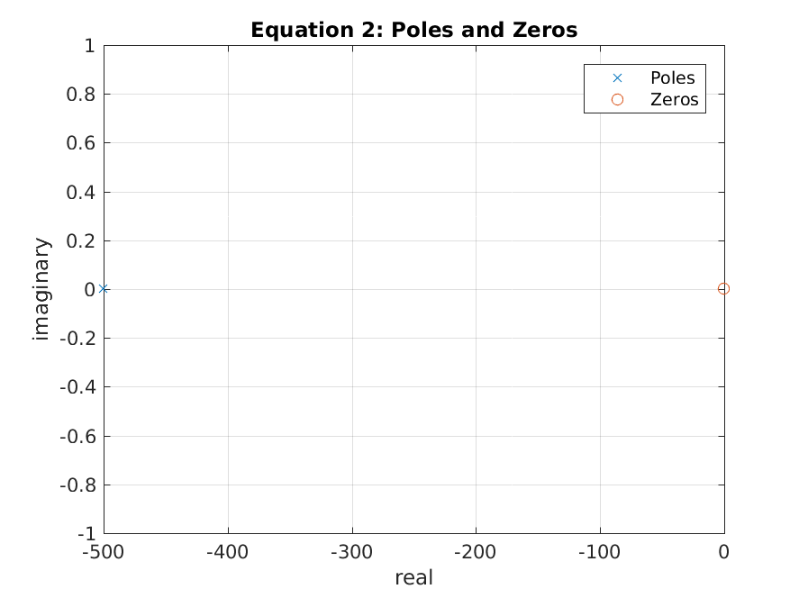

---
title:
- "PreLab 3"
date:
- July 28th, 2017
geometry:
- margin=2cm
author:
- "Matthew Long"
header-includes:
- \usepackage[american]{circuitikz}
- \usetikzlibrary{snakes,arrows,shapes}
- \usepackage{amsmath}
---
# PreLab
## Section 1
#### Equation 1

$$
H(s) = 100 (\ \frac{s+1}{s+400} )\
$$

#### Equation 2

$$
H(s) = 300 (\ \frac{s}{s+500} )\
$$

#### Equation 3

$$
H(s) = 3 \frac{(s+2)(s+100)}{s^2 + 11000s + 10^7}
$$

### The factorized forms

#### Equation 1

$$
H(s) = 100 (\ \frac{s+1}{s+400} )\
$$

$$
H(j \omega) = 100 (\ \frac{j \omega +1}{j \omega +400})\
$$

* $p_1$ = 400, $z_1$ = 1, $K$ = 100

$$
H(j \omega) = \frac{A (\ \frac{j \omega}{1} + 1)\ }{ (\ \frac{j \omega}{400} + 1)\ }
$$

$$
A = K (\ \frac{z_1}{p_1})\
$$

$$
A = 100 (\ \frac{1}{400})\
$$

$$
A = \frac{1}{4}
$$

#### Equation 2

$$
H(s) = 300 (\ \frac{s}{s+500} )\
$$

$$
H(j \omega ) = 300 (\ \frac{j \omega}{j \omega + 500} )\
$$

* $p_1$ = 500, $K$ = 300, $z_1$ = 1

$$
H(j \omega) = \frac{A(\ \frac{j \omega}{0} + 1)\ }{\frac{j \omega}{500} + 1}
$$

$$
A = K(\ \frac{z_1}{p_1} )\
$$

$$
A = 1
$$

#### Equation 3

$$
H(s) = 3 \frac{(s+2)(s+100)}{s^2 + 11000s + 10^7}
$$

$$
H(j \omega) = 3 \frac{( j \omega + 2)(j \omega + 100)}{((j \omega)^2 + 11000j \omega + 10^7)}
$$

$$
H(j \omega) = 3 \frac{(j \omega + 2)(j \omega + 100)}{(j \omega + 10000)(j \omega + 1000)}
$$

$$
H(j \omega) = \frac{ A(\ \frac{j \omega}{2} + 1)\ (\ \frac{j \omega}{100} + 1)\ }{(\ \frac{j \omega}{10000} + 1)\ (\ \frac{j \omega}{1000} +1 )\ }
$$

* $z_1$ = 2, $z_2$ = 100, $p_1$ = 10000, $p_2$ = 1000, $K$ = 3

$$
A = K (\ \frac{z_1 * z_2}{p_1 * p_2})\
$$

$$
A = 3 (\ \frac{2*100}{10000*1000} )\
$$

$$
A = 0.00006
$$

### The poles and zeros
#### Equation 1
* Poles: -400
* Zeros: -1

#### Equation 2
* Poles: -500
* Zeros: 0

#### Equation 3
* Poles: -10000, -1000
* Zeros: -2, -100

### The pole-zero diagram
#### Equation 1

* Consult Figure 1 for the graph of the poles and zeros.

{width=75% height=75%}

#### Equation 2

* Consult Figure 2 for the graph of the poles and zeros.

{width=75% height=75%}

#### Equation 3

* Consult Figure 3 for the graph of the poles and zeros.

{width=75% height=75%}

### The upper and lower frequency limits, i.e, $H(0)$ and $H(\infty)$
#### Equation 1

---------------------------------------------------------------
$\omega$		$H(\omega)$ function				$H(\omega)$
--------		-----------------------				-----------
0				$100 \frac{0+1}{0+400}$				0.25

$\infty$		$100 \frac{\infty+1}{\infty+400}$	undefined
---------------------------------------------------------------

#### Equation 2

---------------------------------------------------------------
$\omega$		$H(\omega)$ function				$H(\omega)$
--------		-----------------------				-----------
0				$300\frac{0}{0+500}$				0		

$\infty$		$300\frac{\infty}{\infty+500}$		undefined
---------------------------------------------------------------

#### Equation 3

---------------------------------------------------------------------------------------
$\omega$		$H(\omega)$ function										$H(\omega)$
--------		-----------------------										-----------
0				$3\frac{(0+2)(0+100)}{0^2 + 11000*0 + 10^7}$				$2*10^{-5}$

$\infty$		$3\frac{(\infty+2)(\infty+100)}{\infty^2 + 11000*0 + 10^7}$	undefined
---------------------------------------------------------------------------------------

### The Bode (straight line) Approximation gain response in dB
#### Equation 1

$$
|H(j \omega)| = \frac{A | (\ \frac{j \omega}{z_1} + 1)\ | }{| (\ \frac{j \omega} {p_1} + 1 )\ | }
$$

$$
H,dB = +20 \log_{10} A + 20 \log_{10} |(\frac{j \omega}{z_1} + 1)\ | -20 \log_{10} |(\ \frac{j \omega}{p_1} + 1 )\ |
$$

* Consult Figure 4 for the graph of this.

{width=75% height=75%}

#### Equation 2

$$
|H(j\omega)| = \frac{A | (\ \frac{j \omega}{0} + 1)\ | }{| \frac{j\omega}{500} + 1 | }
$$

$$
H,dB = +20 \log_{10} A + 20 \log_{10}|( \frac{j \omega}{0} + 1 )| - 20 \log_{10} |(\frac{j \omega}{500} + 1)|
$$

* Consult Figure 5 for the graph of this.

{width=75% height=75%}

#### Equation 3

$$
|H (j \omega) = \frac{A |( \frac{j \omega}{2} + 1) (\frac{j \omega}{100} + 1 ) | }{ | (\frac{j \omega}{10000} + 1)( \frac{j \omega}{1000} + 1 ) | }
$$

$$
H,dB = +20 \log_{10} A + 20 \log_{10} (\frac{j \omega}{2} + 1) + 20 \log_{10} (\frac{j \omega}{100}) - 20 \log_{10} (\frac{j \omega}{10000} + 1) - 20 \log_{10} (\frac{j \omega}{1000} + 1)
$$

* Consult Figure 6 for the graph of this.

{width=75% height=75%}

## Section 2

### Solve for the transfer functions, $H(s)=V_0 / V_i$

#### Circuit 1

$$
L(C) = \frac{1}{C_s} = \frac{10^6}{25} \Omega
$$

$$
H(s) = \frac{V_{out}}{V_{in}} = \frac{(10^6 / 25 )}{10^3 + 10^6 /25} = \frac{1000}{1025}=0.976
$$

#### Circuit 2

$$
L(c) = \frac{1}{s* 0.1uF} = \frac{10^7}{s}
$$

$$
Z_{R_{2k}C} = \frac{20k \Omega}{20 k \Omega * \frac{10^7}{s}}
$$

$$
Z_{R_{2k}C}= 19512.20
$$

$$
\frac{V_{out}}{V_{in}} = \frac{Z_{R_{2k}C}}{1k} = \frac{19512.20}{1000} = 19.51
$$

$$
H(s) = 19.51
$$
