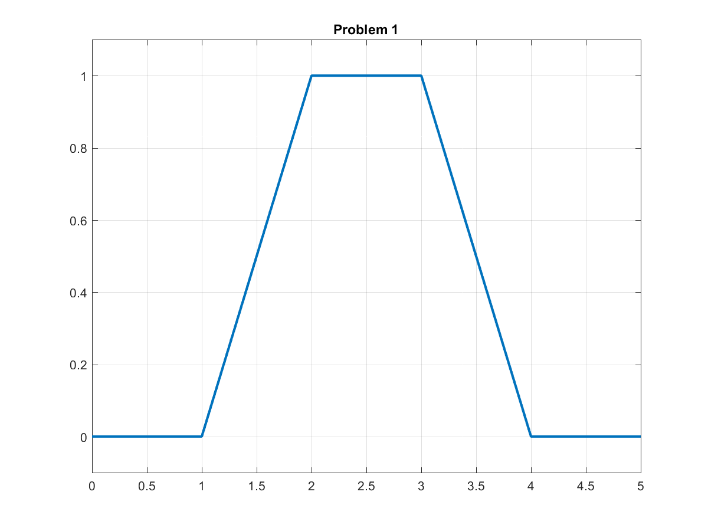
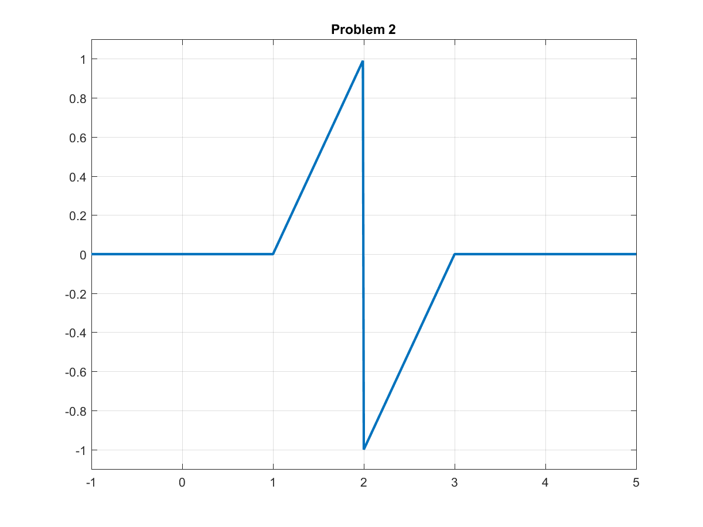
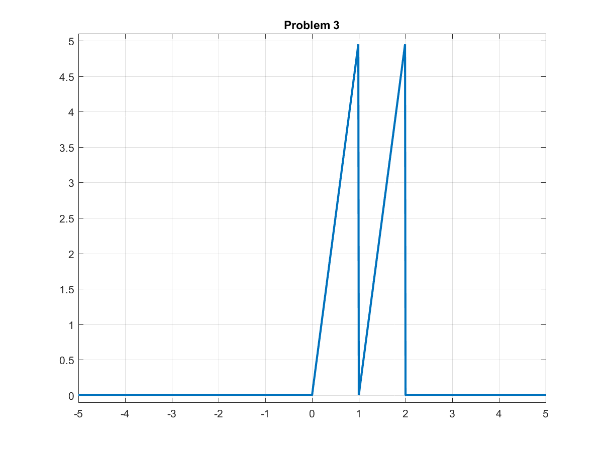
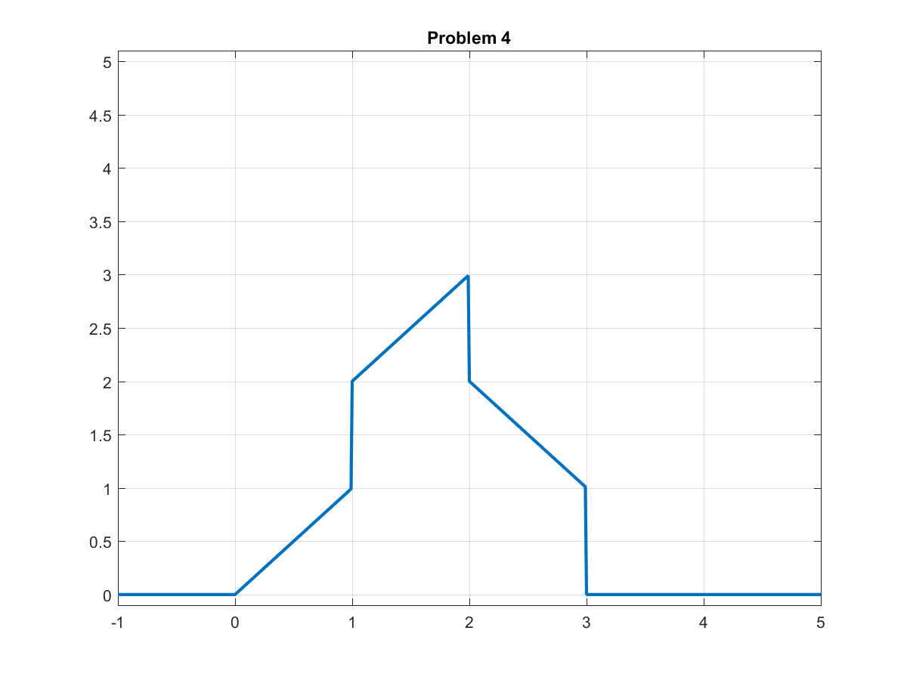
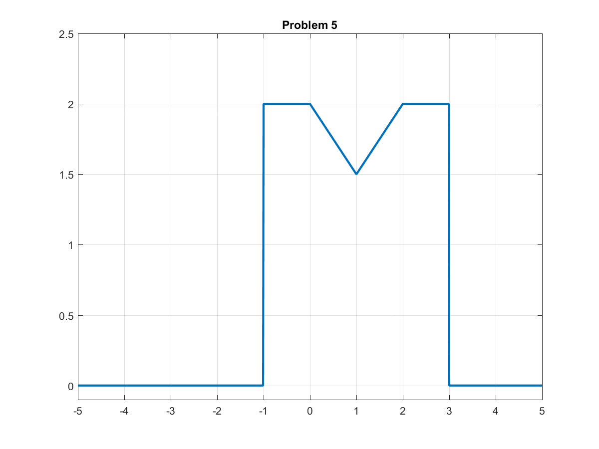

---
header-includes:
- \usepackage{graphicx}
title:
- "ECES 301: Project 1"
author:
- "Matthew Long"
date:
- "July 7, 2017"
geometry:
- margin=2.5cm
---
# Introduction

&nbsp;&nbsp;&nbsp;&nbsp;&nbsp;&nbsp;This project encompassed the utilization of the ramp and unit step
functions to generate the desired graphs. The ramp function is, as the name
would imply, a function that produces an output similar to a ramp. It is
easy to think of the function as only the positive values of $y=x$. The unit
step function is a function that allows one to easily manage equations by simply multiplying
1 or 0 to the equation in question based on the input (normally used to
specify only positive values of a function that is relevant or utilized). By
combining these simple functions with the addition, subtraction,
multiplication and/or division of scalars allows one to construct intricate
graphs, a sample of which can be found below.

# Problem 1

The output of this code can be found in Figure 1 at the end of the document.

```Matlab
input_time = 0:0.01:5;
ramp=@(t) t.*(t>=0);
desired_output =
ramp(input_time-1)-ramp(input_time-2)-ramp(input_time-3)+ramp(input_time-4);
plot(input_time, desired_output, 'LineWidth', 2);
ylim([-0.1 1.1]);
title('Problem 1');
grid on;
```

# Problem 2

The output of this code can be found in Figure 2 at the end of the document.

```Matlab
input_time = -1:0.01:5;
ramp=@(t) t.*(t>=0);
u=@(t) t>=0;
desired_output = ramp(input_time-1)-2*u(input_time-2)-ramp(input_time-3);
plot(input_time, desired_output, 'LineWidth', 2);
ylim([-1.1 1.1]);
title('Problem 2');
grid on;
```

# Problem 3

The output of this code can be found in Figure 3 at the end of the document.

```Matlab
input_time = -5:0.01:5;
ramp=@(t) t.*(t>=0);
u=@(t) t>=0;
desired_output =
5*ramp(input_time)-5*u(input_time-1)-5*ramp(input_time-2)-5*u(input_time-2);
plot(input_time, desired_output, 'LineWidth', 2);
ylim([-0.1 5.1]);
title('Problem 3');
grid on;
```

# Problem 4

The output of this code can be found in Figure 4 at the end of the document.

```Matlab
input_time = -1:0.01:5;
ramp=@(t) t.*(t>=0);
u=@(t) t>=0;
desired_output =
ramp(input_time)+u(input_time-1)-u(input_time-2)-2*ramp(input_time-2)-u(input_time-3)+
	ramp(input_time-3);
plot(input_time, desired_output, 'LineWidth', 2);
ylim([-0.1 5.1]);
title('Problem 4');
grid on;
```

# Problem 5

The output of this code can be found in Figure 5 at the end of the document.

```Matlab
input_time = -5:0.01:5;
ramp=@(t) t.*(t>=0);
u=@(t) t>=0;
desired_output =
2*u(input_time+1)-0.5*ramp(input_time)+ramp(input_time-1)-0.5*ramp(input_time-2)-
	2*u(input_time-3);
plot(input_time, desired_output, 'LineWidth', 2);
ylim([-0.1 2.5]);
title('Problem 5');
grid on;
```
$\pagebreak$

# Table of Equations

------------------------------------------------------------------------------------
Problem		Equation
-------     ------------------------------------------------------------------------
	1		$f(t) = ramp(t-1)-ramp(t-2)-ramp(t-3)+ramp(t-4)$

	2		$f(t) = ramp(t-1)-2U(t-2)-ramp(t-3)$

	3		$f(t) = 5ramp(t)-5U(t-1)-5ramp(t-2)-5U(t-2)$

	4		$f(t) = ramp(t)+U(t-1)-U(t-2)-2ramp(t-2)-U(t-3)+ramp(t-3)$

	5		$f(t) = 2U(t+1)-\frac{1}{2}ramp(t)+ramp(t-1)-\frac{1}{2}ramp(t-2)-2U(t-3)$
-------     ------------------------------------------------------------

# Graphs

{ width=75% height=75% }

{ width=75% height=75% }

{ width=75% height=75% }

{ width=75% height=75% }

{ width=75% height=75% }
